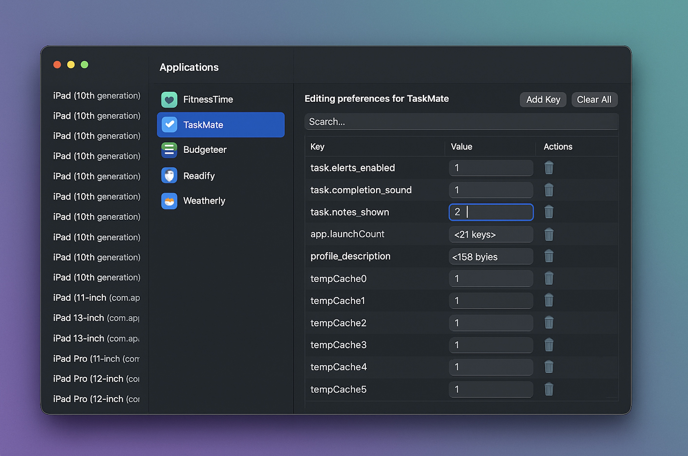

# AppPrefs Viewer

**AppPrefs Viewer** is an open-source macOS app for developers, created by the Ardora team.  
It allows you to inspect and modify `UserDefaults` (plist) data of apps running in the iOS Simulator.

<p align="center">
  
</p>

## ✨ Features

- Browse installed iOS Simulator apps  
- View and edit `UserDefaults`  
- Real-time updates with file watching  
- Clear or reset values easily

## ❓ Why?

This tool is helpful for debugging preferences, testing onboarding flows, and inspecting app state stored in `UserDefaults`.

## 📦 Installation

Clone this repo and open in Xcode:

```bash
git clone https://github.com/ardoralab/AppPrefsViewer.git
open AppPrefs\ Viewer/AppPrefs\ Viewer.xcodeproj
```

## 👨‍💻 Contributing

Feel free to open issues or pull requests.  
We're open to contributions from the community!

## 📬 Join Us

Stay up to date: [@ArdoraLab Telegram Channel](https://t.me/ardoralab)

## 📄 License

This project is licensed under the MIT License.  
See [LICENSE](LICENSE) for details.
